# What the field actually built

Inventory of interactive and generative-AI learning systems. Source file for
`deckbuilder`. Screenshots live in `screenshots/` and are inlined at build time.

Provenance: full system dossiers with page-level URLs in
`coord/work/{agy,codex,claude,fable}/T-012-*.md`; synthesis in `INVENTORY.md`.

---

## SLIDE 1 — Title

<!--visual

  <h1>What the field actually built</h1>
  
Twenty interactive and generative-AI learning systems, read for the
  mechanisms worth stealing

  
Census, August 2026 · not an evidence review

-->

This is a census, not a review of evidence.

A system does not need a randomised trial to be here. What it needs is a mechanism worth
stealing.

I looked at four families, kept twenty systems, and read each one with a single question:
what does it do inside that we could use?

## SLIDE 2 — How it was built

<!--visual
<h2>How this inventory was built</h2>

  
<b>Four lanes</b>Manipulables · adaptive tutors ·
    generative-AI natives · adjacent markets. Disjoint, so nothing was researched twice

  
<b>One rule</b>Entry by <b>mechanism sophistication</b>, not
    scale. A system with 100M users and a trivial mechanism does not make the cut

  
<b>One lens</b>For each system: what does it do inside, and is
    it stealable

  
<b>Captures</b>26 screenshots, headless browser, deep links into
    the mechanism. No accounts created, no logins

Method Four
research lanes run in parallel; dossiers with page-level URLs in coord/work/

-->

Four lanes, run in parallel and kept disjoint so nothing was researched twice.

The entry rule was mechanism sophistication, not scale. A product with a hundred million
users and a trivial mechanism does not make the cut. A small project with one excellent
engineering idea does.

Twenty-six screenshots, taken with a headless browser and deep links that land inside the
mechanism rather than on the marketing page.

One limit I want to state at the top: no accounts were created and nothing was logged
into. Everything behind a registration wall is described from the vendor's own
documentation, not from what I saw on screen.

## SLIDE 3 — The finding that dominates

<!--visual

  
The finding that dominates the census

  <h2>The most sophisticated mechanisms in this inventory are <em>not generative</em>.</h2>
  
MATHia · ALEKS · Desmos Computation Layer · PhET · Polypad · CODAP ·
  NetLogo · Smart Sparrow — none uses generative AI in its pedagogical core.

Our synthesis · across all
four lanes No single lane produced this; it comes from
crossing them

-->

Here is the finding that dominates the whole census, and it was not what I expected.

The systems with the deepest engineering are not generative.

MATHia, ALEKS, the Desmos Computation Layer, PhET, Polypad, CODAP, NetLogo, Smart Sparrow.
Not one of them uses generative AI in its pedagogical core.

And this is not a case of them being late. The next slide is the one that proves it.

## SLIDE 4 — The proof case

<!--visual

  
The case that proves it is not lateness

  <h2>CENTURY adopted generative AI — and deliberately kept it <em>out</em> of the
  decision path.</h2>

  
<b>Where they use it</b>Printable worksheet generation. Their own
  documentation states mathematics is excluded, for reliability.

  
<b>Where they refuse to</b>The Recommended Path — what the student studies
  next — is untouched by it.

  
<b>The split they chose</b><em>Generative at the surface, deterministic at the
  decision.</em>

Evidence · CENTURY product
documentation Researched in lane 2 (codex), with support
URLs in the dossier

-->

CENTURY did adopt generative AI. And they put it deliberately outside the decision path.

They use it to generate printable worksheets. Their own documentation admits mathematics
is excluded, for reliability.

Meanwhile the Recommended Path — the thing that decides what the student studies next —
does not touch it.

So the split the serious systems chose in twenty twenty-six is: generative at the surface,
deterministic at the decision.

I will come back at the end to what that means for us, because our judge sits on the
decision side.

## SLIDE 5 — Pattern one

<!--visual
<h2>Pattern 1 · The AI picks from a closed menu. It does not invent the move.</h2>
<table class="results wide">
  <tr><th>System</th><th>The closed menu</th></tr>
  <tr><td><b>Amira Learning</b></td><td>≈60 micro-interventions written by reading
    scientists</td></tr>
  <tr><td><b>Tutor CoPilot</b></td><td>7 strategies, chosen by humans</td></tr>
  <tr><td><b>Khanmigo</b></td><td>hints and worked solution written by hand
    <b>for that specific exercise</b>, injected before it answers</td></tr>
  <tr><td><b>Eedi + LearnLM</b></td><td>the human tutor approves or edits every message
    before it is sent</td></tr>
  <tr><td><b>SchoolAI</b></td><td>the teacher fixes the boundaries before the student
    enters</td></tr>
</table>

Generative freedom is used to <b>deliver</b> the intervention, never to
<b>choose</b> it.

Our synthesis · five
independent systems Lane 3 (claude), cross-checked
against T-002

-->

Four patterns turned up across the lanes. This is the first and the most useful.

The AI picks from a closed menu. It does not invent the pedagogical move.

Amira chooses among roughly sixty micro-interventions written by reading scientists. Tutor
CoPilot has seven strategies. Khanmigo injects hints and a worked solution written by hand
for that specific exercise. In the Eedi trial, a human approves every message before it is
sent. In SchoolAI, the teacher fixes the boundaries before the student even enters.

Five systems that did not copy each other. The generative freedom is used to deliver the
intervention, never to choose it.

## SLIDE 6 — Pattern two

<!--visual
<h2>Pattern 2 · Teacher authority is an architectural layer, not a reports page.</h2>
<ol class="checks">
  <li><b>CENTURY</b> — the model's prediction does not execute. It passes through policy
  rules, and what the teacher pins <b>takes precedence and stays visible in the trace</b></li>
  <li><b>ALEKS</b> — the instructor can request a knowledge check for one specific
  student: an explicit human action on the engine</li>
  <li><b>MATHia</b> — the at-risk alert fires on position against historical cohorts, and
  <b>shows the signals that triggered it</b></li>
  <li><b>Smart Sparrow</b> — authored rules, versioned, with preview before publishing</li>
  <li><b>Cognii</b> — literal replay of any exchange, for the teacher to review</li>
</ol>

Our synthesis · five
systems in lane 2 Researched by codex — the cleanest
convergence in the inventory

-->

Pattern two, and it is the cleanest convergence in the whole inventory.

Teacher authority is an architectural layer, not a reports page.

In CENTURY the model's prediction does not execute directly. It passes through policy
rules, and what the teacher pins takes precedence and stays visible in the trace.

ALEKS lets the instructor request a knowledge check for one specific student. MATHia's
risk alert shows the signals that triggered it, not just the alert. Smart Sparrow versions
its authored rules with a preview before publishing. Cognii keeps a literal replay of any
exchange so the teacher can review it.

For us that changes something concrete, and I will come back to it.

## SLIDE 7 — Pattern three

<!--visual
<h2>Pattern 3 · The sophistication is in the constraint engine, not the drawing.</h2>
<table class="results wide">
  <tr><th>System</th><th>The friction it absorbs</th></tr>
  <tr><td><b>Polypad</b></td><td>motor friction — pieces snap by semantic and topological
    awareness of each other</td></tr>
  <tr><td><b>CODAP</b></td><td>“which row is this point?” — shared selection across table,
    map and plot</td></tr>
  <tr><td><b>Observable</b></td><td>“did I run the cells in order?” — a reactive dependency
    graph</td></tr>
  <tr><td><b>PhET</b></td><td>“what am I allowed to do?” — implicit scaffolding through
    visual affordances</td></tr>
  <tr><td><b>Desmos CL</b></td><td>wiring two components together — a reactive language of
    sinks and sources</td></tr>
  <tr><td><b>NetLogo</b></td><td>the distance between the micro rule and the macro
    effect</td></tr>
</table>

Our synthesis · lane 1
Researched by agy; the friction framing is theirs

-->

Pattern three comes from the manipulables lane, and it reframed how I read all of them.

The sophistication is in the constraint engine, not the drawing.

Every first-division manipulable removes one specific kind of friction, so the student's
attention lands on the relationship being taught instead of on the interface.

Polypad absorbs motor friction: the pieces snap because they know, semantically, what
they are. CODAP absorbs "which row is this point", by sharing one selection across table,
map and plot. Observable absorbs the question of whether you ran the cells in order. PhET
absorbs "what am I allowed to do here".

None of that is visible as a feature. All of it is why they feel good.

## SLIDE 8 — Pattern four

<!--visual
<h2>Pattern 4 · The authoring model decides whether the system scales.</h2>

  
<b>Closed and very expensive</b><b>PhET.</b> Each simulation needs a software
  team, an instructional designer and weeks of user testing. No visual authoring tool for
  teachers.

  
<b>Hybrid — the only one that solves both</b><b>Desmos.</b> Expensive official
  content <em>plus</em> the Activity Builder with Computation Layer, open and free to any
  teacher.

  
<b>Frictionless</b><b>CODAP.</b> Upload a CSV, drag a plot, share the link.
  <b>MATHia / ALEKS / CENTURY:</b> the teacher sequences, but cannot edit the knowledge
  model.

This is the census's only answer to “what does concept number twenty
cost?”

Our synthesis · lane 1
Researched by agy

-->

Pattern four, and it is the census's only real answer to the question of what concept
number twenty costs.

The authoring model decides whether the system scales.

PhET is closed and very expensive. Each simulation needs a software team, an instructional
designer, and weeks of testing with actual students. There is no visual authoring tool.

Desmos is hybrid, and it is the only model here that solves both sides. Expensive official
content, plus an activity builder with a real scripting layer, open and free to any
teacher.

And in the adaptive tutors, the teacher can sequence but cannot edit the knowledge model
that governs the adaptation. That is a ceiling worth noticing before adopting one.

## SLIDE 9 — Family one

<!--visual
<h2>Family 1 · Manipulables, simulations, explorables</h2>

  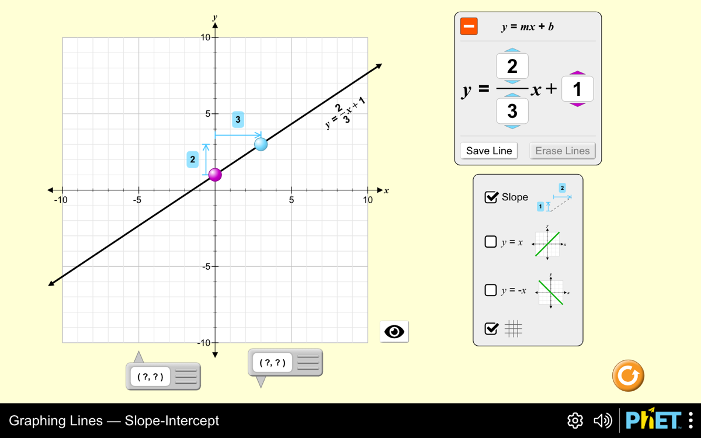
  

    
Six systems · researched by agy

    
What they share
    None of them uses generative AI. All of them are engineering-heavy underneath, and
    the engineering is spent on <b>removing friction</b> rather than on adding features.

    
<b>PhET, Graphing Lines.</b> The equation is coupled to the graph:
    change one and the other follows. Reached with a deep link straight into the
    manipulable — the landing page only shows a menu.

  

Evidence · phet.colorado.edu
Screenshot taken 2026-08-11, public simulation, no login

-->

Now the four families, and the systems themselves.

First, manipulables and simulations. Six systems, none of which uses generative AI, and
all of which are heavier in engineering than they look.

What you are seeing is PhET's graphing lines simulation, reached with a deep link that goes
straight into the manipulable. The landing page only shows a menu.

Look at what it does: the equation and the graph are coupled. Change the fraction in the
equation and the line moves; drag the point and the equation updates. That coupling is the
whole lesson, and it is exactly the thing we are building for the budget line.

## SLIDE 10 — PhET

<!--visual
<h2>PhET Interactive Simulations — University of Colorado Boulder</h2>

  

    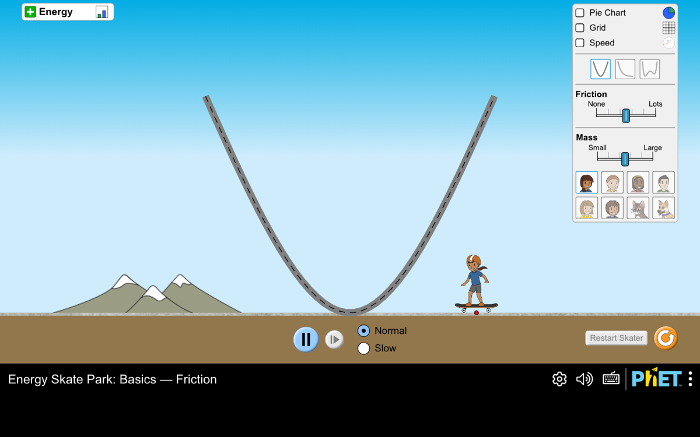
    

      
    

  

  

    
The stealable mechanism
    <b>Implicit scaffolding.</b> The degrees of freedom are restricted so the productive
    action is visually obvious — no instructions needed.  
    And a <b>parallel DOM tree</b> that mirrors the visual scene, giving screen-reader
    navigation and generative sonification of physical values.

    
Accessibility is not a bolt-on here. It is the reason the
    architecture looks the way it does — and it is the direct prior art for our own
    textual alternative to a manipulable graph.

  

Evidence · PhET published architecture
Lane 1 (agy) · screenshots public, no login

-->

PhET, from the University of Colorado, is the reference point for the whole family.

Two mechanisms worth taking. The first is implicit scaffolding: they restrict the degrees
of freedom so that the productive action is visually obvious, and the student needs no
instructions.

The second is the one I did not know about. They maintain a parallel tree in the document
that mirrors the visual scene. That is what gives them screen reader navigation and
sonification of physical values.

Accessibility is not bolted on at PhET. It is the reason the architecture looks the way it
does. And it is the direct prior art for the textual alternative to a manipulable graph
that our own accessibility decision requires.

## SLIDE 11 — Desmos

<!--visual
<h2>Desmos Classroom + Computation Layer — Amplify</h2>

  

    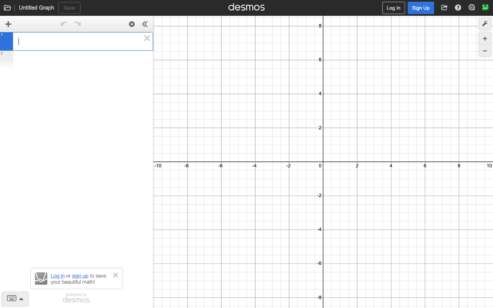
    

      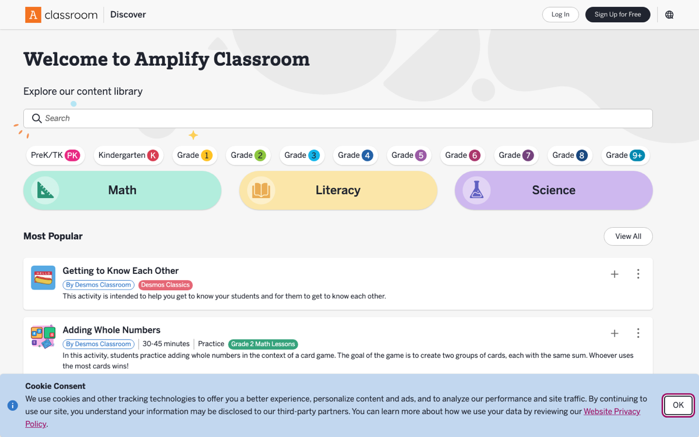
    

  

  

    
The stealable mechanism
    <b>Computation Layer.</b> A reactive, purely functional scripting language. Every
    component exposes <em>sinks</em> and <em>sources</em>; the author wires one component's
    output to another's input. No loops, no mutable state.  
    Plus, for the classroom: <b>pacing</b> to hold students on a screen, and
    <b>anonymize</b> to project answers without exposing anyone.

    
Authoring model: expensive official content <b>and</b> the same
    builder, free, for any teacher. The only model in the census that solves quality and
    cost at once.

  

Evidence · Desmos / Amplify documentation
Lane 1 (agy)

-->

Desmos is the one I would study hardest if we only had time for one.

The Computation Layer is a reactive, purely functional scripting language. Every component
on screen exposes what they call sinks and sources, and the author wires the output of one
into the input of another. No loops, no mutable state to get wrong.

That is the abstraction that lets a teacher who does not program build something with the
same interactivity as the in-house team.

And two classroom mechanisms worth copying on their own: pacing, which holds students on a
given screen, and anonymize, which lets a teacher project the class's answers without
exposing anybody.

## SLIDE 12 — Polypad and CODAP

<!--visual
<h2>Polypad · CODAP — constraint engines you can feel</h2>

  

    
    

      
    

  

  

    
Polypad — Mathigon / Amplify
    <b>Snapping and constraint engine.</b> Pieces have semantic and topological awareness
    of each other: fraction blocks arrange into a circle, polygons snap on compatible
    edges, algebra tiles tip a virtual balance according to their equations.

    
CODAP — Concord Consortium
    <b>Linked representations.</b> One shared selection state across table, map and plot:
    drag a box over a cluster of points and the exact rows highlight everywhere else.

  

Evidence · product documentation
Lane 1 (agy) · both captured live, no login

-->

Two more from the same family, both of them constraint engines you can feel.

Polypad's pieces have semantic and topological awareness of each other. Fraction blocks
arrange themselves into a circle. Polygons snap along compatible edges. Algebra tiles tip a
virtual balance according to the equations they represent. The engine absorbs all the motor
friction so the student's attention lands on the mathematical relationship.

CODAP does the same thing for data. One shared selection state across a table, a map and a
plot. Drag a box over a cluster of points and the exact rows light up everywhere else. It
lets a student reason about a dataset without writing a line of code.

## SLIDE 13 — Observable and NetLogo

<!--visual
<h2>Observable · NetLogo Web — reactive engines</h2>

  

    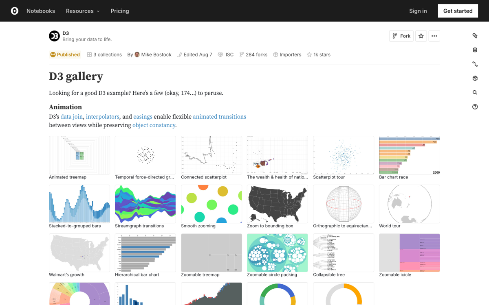
    

      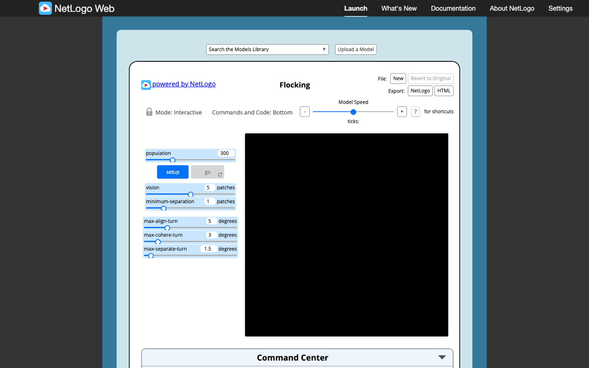
    

  

  

    
Observable
    <b>Reactive dataflow graph.</b> Unlike a notebook where state depends on the arbitrary
    order you ran the cells, it builds a dependency graph: change a variable and everything
    downstream re-evaluates, spreadsheet-style. The right engine for zero-latency
    explorables.

    
NetLogo Web — Northwestern
    <b>Agent-based concurrency.</b> You write the rule for one wolf; the engine runs
    thousands and plots the population dynamics live.

    
NetLogo shown before pressing <b>setup</b> — the canvas is black
    because the model has not been run.

  

Evidence · product documentation
Lane 1 (agy)

-->

Two reactive engines to close the family.

Observable builds a dependency graph out of your code. In an ordinary notebook the state
depends on the arbitrary order in which you ran the cells, which is where hidden errors
live. Here, change a variable and everything downstream re-evaluates, like a spreadsheet.
That is the right engine for an explorable with no latency.

NetLogo takes a different route. You write the rule for a single wolf, and the engine runs
thousands of them and plots the population dynamics live. It collapses the distance between
the micro rule and the macro effect, which is a very hard thing to teach any other way.

One honest note on that capture: it is before pressing setup, so the canvas is black.

## SLIDE 14 — Family two

<!--visual
<h2>Family 2 · Adaptive and domain tutors</h2>

  

    
    

      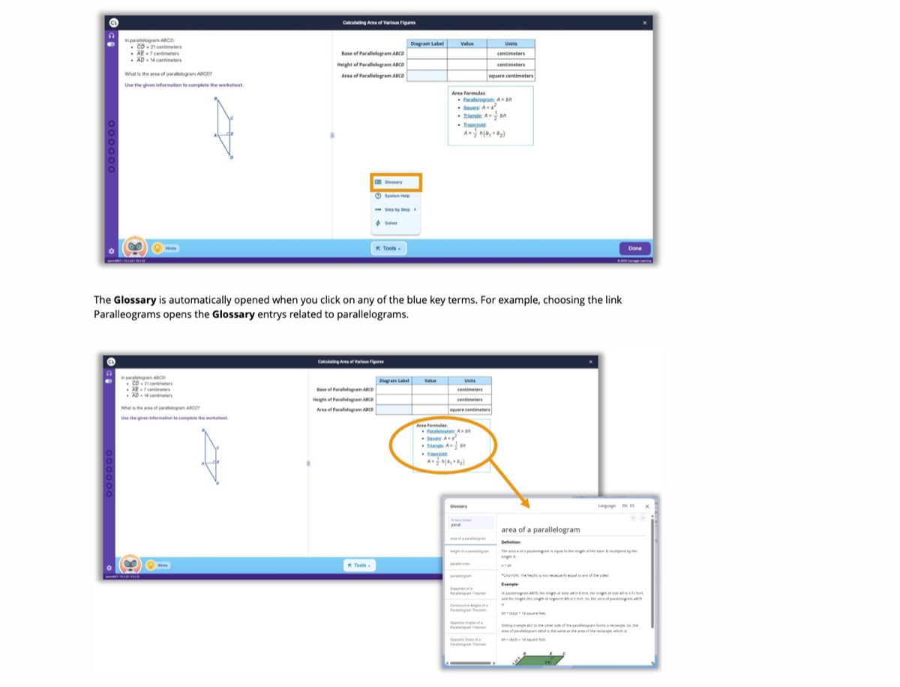
      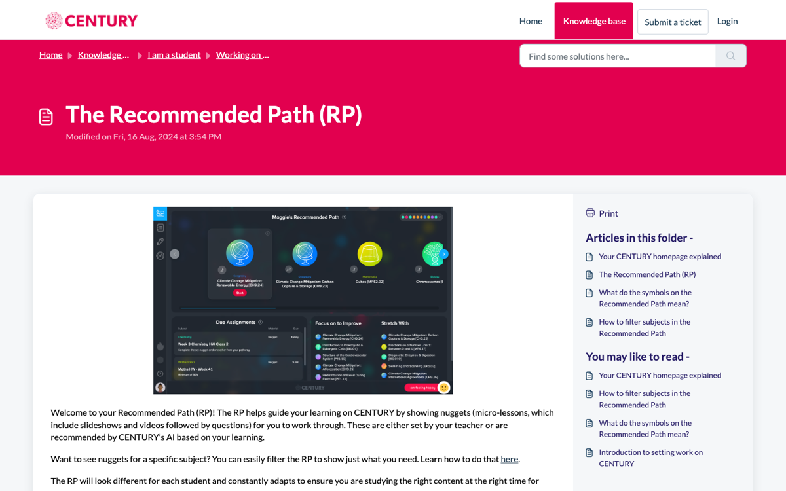
      
    

  

  

    
Five systems · researched by codex

    
MATHia — Carnegie Learning
    Mastery probability per skill, <b>plus</b> a contextual risk detector: it alerts not on
    low probability alone, but when the student has reached a point where historical cohorts
    had already mastered the skill. The alert shows the signals that fired it.

    
ALEKS
    A family of feasible knowledge states; it teaches at the <b>outer fringe</b>, and its
    knowledge checks can send a topic you had learned back to practice.

  

Evidence · vendor support documentation
Lane 2 (codex) · product pages only; the classroom is behind a login

-->

Second family: the adaptive tutors, and this is the tradition that has been doing our job
for thirty years.

MATHia keeps a mastery probability per skill, but the mechanism worth taking is what sits
on top. A contextual risk detector that alerts not when the probability is low, but when
this student has reached a point where historical cohorts had already mastered that skill.
And crucially, the alert shows the teacher the signals that fired it.

ALEKS represents the domain as a family of feasible knowledge states, and teaches at what
they call the outer fringe — the topics immediately reachable from where the student
actually is. Its knowledge checks can send a topic you had already learned back to
practice, which is an honesty most systems avoid.

## SLIDE 15 — CENTURY and Cognii

<!--visual
<h2>CENTURY · Cognii · Smart Sparrow</h2>

  

    
    

      
    

  

  

    
Cognii — the one closest to our judge
    Turns a free-text answer into <b>concepts present, absent, or partially expressed</b> —
    not into a score. That difference is what produces the coaching turn, and the whole
    exchange stays as auditable evidence.

    
Smart Sparrow (dead, absorbed by Pearson)
    Authorable pedagogical rules over rich telemetry, versioned, with preview before
    publishing. A dead system with a live idea.

  

Evidence · vendor documentation
Lane 2 (codex) · Smart Sparrow included deliberately: dead systems with
good ideas are still quarry

-->

Cognii is the system in this census closest to what our judge is supposed to do.

It turns a free-text answer into concepts present, concepts absent, and concepts partially
expressed. Not into a score. That difference is what generates the coaching response, and
the whole exchange stays as auditable evidence a teacher can replay.

If you take one thing from this slide: the unit that feeds mastery should not be "the model
said zero point seven two". It should be the list of expected concepts, the list observed,
and what is missing.

And I kept Smart Sparrow in even though it is dead and absorbed by Pearson, because its
idea is alive: authorable pedagogical rules over rich telemetry, versioned, with a preview
before you publish.

## SLIDE 16 — Family three

<!--visual
<h2>Family 3 · Generative-AI natives</h2>

  

    
    

      
      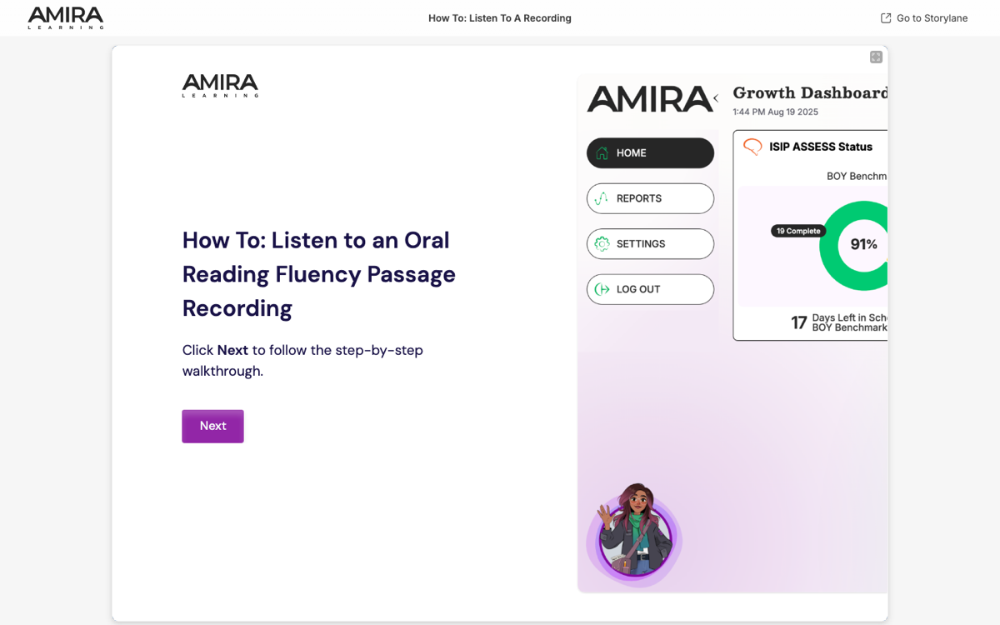
      
    

  

  

    
Six systems · researched by claude

    
Khanmigo — three pieces, all transferable
    <b>1.</b> Arithmetic leaves the model for a deterministic calculator. 
    <b>2.</b> Authorised context injected before it answers: the hints and worked solution a
    human wrote for <em>that</em> exercise. 
    <b>3.</b> A hidden block where it enumerates the student's plausible derivations before
    choosing the visible move.

    
Separate <b>reasoning</b>, which is private and tool-assisted, from
    <b>answering</b>, which is public and socratic.

  

Evidence · Khan Academy engineering blog
Lane 3 (claude) · mechanism audited in task T-002

-->

Third family: the systems whose reason for existing is generative AI.

Khanmigo is the only one at scale whose internals its own engineers have documented, and
there are three pieces worth taking.

First, arithmetic leaves the model. They built a calculator rather than trusting prediction.

Second, they inject authorised context before it answers — the hints and the worked
solution that a human wrote for that specific exercise. The model does not improvise the
pedagogy of the item; it reads it.

Third, and this is the subtle one: a hidden block where the model enumerates the plausible
derivations that could have led the student to what they wrote, before choosing the visible
move. Reasoning is private and tool-assisted. Answering is public and socratic.

## SLIDE 17 — NotebookLM and Amira

<!--visual
<h2>NotebookLM · Amira Learning</h2>

  

    
    

      
    

  

  

    
NotebookLM — Google
    <b>Strict grounding in a closed corpus, with a click-through citation on every claim.</b>
    Not "the model tries not to hallucinate" — the answer is useless unless it can point at
    the source span, and the interface makes that obvious.  
    Second mechanism: <b>one authoring, many surfaces</b>. The same sources become a summary,
    a mind map, and a two-voice audio dialogue.

    
Amira Learning — Carnegie Mellon lineage
    Diagnosis from a modality that <b>is not written text</b>: it listens to the child read
    aloud and detects the specific miscue. Then it selects from ≈60 micro-interventions
    written by reading scientists.

  

Evidence · product documentation
Lane 3 (claude) · Amira's ~60 figure comes from secondary sources —
flagged as unverified in the dossier

-->

Two more from that family, with very different mechanisms.

NotebookLM's is the best-resolved anti-hallucination design in the census. It answers only
about the sources you upload, and every claim carries a citation that takes you to the exact
span in your own document. It is not that the model tries not to hallucinate. It is that the
answer is useless unless it can point at the source, and the interface makes that visible.

That is the pattern our judge needs: justify a diagnosis by citing the fragment of the
student's answer that supports it.

Amira takes a different route entirely. Its diagnosis comes from a modality that is not
written text — it listens to a child read aloud and detects the specific miscue. Then it
selects from a library of micro-interventions written by reading scientists. The error is
observed, not inferred from a final answer.

## SLIDE 18 — Family four

<!--visual
<h2>Family 4 · Adjacent markets</h2>

  

    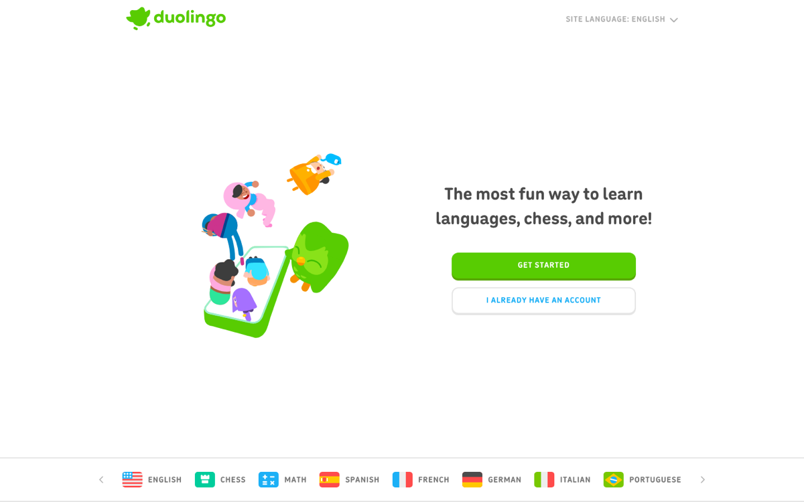
    

      
      
    

  

  

    
Three systems · researched by fable, chosen for mechanism rather than fame

    
Duolingo
    A recall model as a function of time and item difficulty, with generation kept
    <b>inside</b> a fixed sequence.

    
Speak
    Pronunciation recognition as continuous diagnosis — the assessment is the activity.

    
SimConverse
    Clinical conversation simulation with structured assessment of professional performance.
    Chosen over any large corporate platform, on mechanism.

  

Evidence · product documentation
Lane 4 (fable)

-->

The fourth family is the adjacent markets — languages, coding, corporate, professional
simulation. Only three slots, and they were chosen on mechanism rather than fame.

Duolingo models recall as a function of time and item difficulty, and keeps its generative
features inside a fixed sequence rather than letting them drive it.

Speak treats pronunciation recognition as continuous diagnosis, so the assessment is the
activity rather than something bolted on the end.

And SimConverse simulates clinical conversations with structured assessment of professional
performance. It got the slot over any large corporate platform, on mechanism alone. That is
the criterion working as intended.

## SLIDE 19 — What tutorIA takes

<!--visual
<h2>What we take from this</h2>
<ol class="checks">
  <li><b>The judge passes through rules before it acts.</b> Copy CENTURY:
  <code>judge_prediction → policy_rules → action</code>, with a teacher-pinned override that
  takes precedence and stays in the trace</li>
  <li><b>Store the diagnosis as concepts, not a score.</b> Copy Cognii: expected, observed,
  missing or misconstrued</li>
  <li><b>Remediation is a closed menu.</b> The brief's four actions are the repertoire; the
  model selects, it does not invent</li>
  <li><b>Every piece of evidence must be replayable.</b> Copy Cognii's replay and MATHia's
  visible signals</li>
  <li><b>Authoring is the strategic decision, not the renderer.</b> The Desmos axis —
  expensive own content plus an open declarative language — is the only model here that
  solves quality and cost together</li>
</ol>

Our recommendation · five
readings of the census None of these is a finding from a
paper — they are inferences from the inventory

-->

So what do we take from all of this. Five things, and I want to be clear that none of them
is a finding from a paper. They are my readings of the census.

One. The judge passes through rules before it acts. Copy CENTURY's split: the prediction
feeds policy rules, and what the teacher pins takes precedence and stays in the trace.

Two. Store the diagnosis as concepts, not as a score. Expected, observed, missing.

Three. Remediation is a closed menu. The four actions in our brief are the repertoire, and
the model selects among them rather than inventing.

Four. Every piece of evidence must be replayable, with the signal that triggered the
decision visible to the teacher.

Five. Authoring is the strategic decision, not the renderer.

## SLIDE 20 — The uncomfortable one

<!--visual

  <h2>Our judge sits on the decision side — which is exactly where this census says almost
  nobody puts a generative model.</h2>
  
That does not make it wrong. It makes it deliberate. The
  inventory says the field's answer in 2026 is <b>generative at the surface, deterministic
  at the decision</b> — so if we cross that line, we should cross it knowingly, and we
  should be the ones who measure it.

Our conclusion The
census describes what others chose; the decision to differ is ours

-->

And I want to end on the uncomfortable one, because it is the reason this census was worth
doing.

Our judge sits on the decision side. Which is exactly where this inventory says almost
nobody puts a generative model.

That does not make it wrong. It makes it a deliberate departure. The field's answer in
twenty twenty-six is generative at the surface, deterministic at the decision.

So if we are going to cross that line, we should cross it knowing that we are crossing it —
and we should be the ones who measure whether it worked.

## SLIDE A1 — The long tail

<!--visual
<h2>Also registered — the long tail</h2>

<b>Manipulables:</b> GeoGebra · Brilliant · Wolfram Demonstrations · Distill.pub ·
Explorable Explanations (Bret Victor, Nicky Case) · Scratch / Snap! · Molecular Workbench ·
Algodoo · Bootstrap:Algebra

<b>Adaptive tutors:</b> Mindspark · DreamBox · i-Ready · Zearn · Prodigy · IXL ·
Realizeit · Riiid · Knewton (dead)

<b>Generative-AI natives:</b> ChatGPT Study Mode · Claude Learning Mode · MagicSchool ·
Brisk Teaching · Coursera Coach · Synthesis Tutor · Ello · Sizzle

<b>Adjacent:</b> ELSA · Memrise · Replit · Codecademy · Exercism · Boot.dev · DataCamp ·
Sana · Docebo · 360Learning

<b>Economics-specific, and the closest thing to what we are building:</b>
<b>EconGraphs</b> (Christopher Makler, Stanford) — ~350 interactive graphs covering budget
constraints, indifference curves and consumer optimisation, on the MIT-licensed KGJS engine

-->

## SLIDE A2 — EconGraphs

<!--visual
<h2>EconGraphs — the closest thing that already exists</h2>

  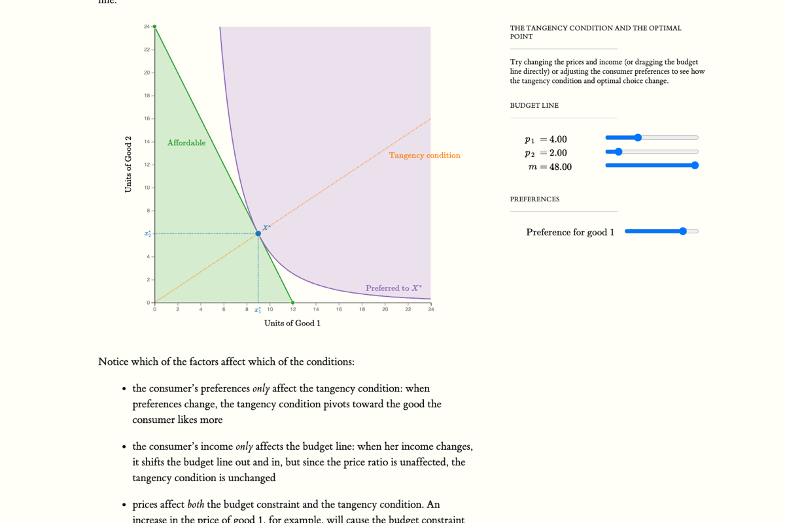

<b>Christopher Makler, Stanford — Econ 50.</b> Budget line, indifference
curve and the tangency condition, with live sliders for both prices and income. The page's
own instruction: <em>“Try changing the prices and income (or dragging the budget line
directly).”</em> Engine: KGJS, MIT licence. Content: Makler's copyright.

Evidence · econgraphs.org §7.6
Captured 2026-08-11, public page, no login

-->

## SLIDE A3 — Method and sources

<!--visual
<h2>Method and sources</h2>

Four research lanes, run in parallel and kept disjoint by explicit claim files that named
the other lanes' systems, so nothing was researched twice and nothing collided.

<b>agy</b> — manipulables, simulations and explorables (6 dossiers).
<b>codex</b> — adaptive and domain tutors (5). <b>claude</b> — generative-AI natives (6).
<b>fable</b> — adjacent markets (3). Synthesis and screenshots by <b>claude</b>.
<b>Kristian</b> set the parameters and is the principal.

Every dossier carries page-level URLs for each claim, or an explicit
unverified mark. They live in <code>coord/work/{agy,codex,claude,fable}/T-012-*.md</code>;
the synthesis is <code>docs/inventory/INVENTORY.md</code>.

<b>Declared limits.</b> No account was created and nothing was logged into. Everything
behind a registration wall — the MATHia classroom, the CENTURY dashboard, Khanmigo,
SchoolAI's Spaces — is described from vendor documentation, not from what was seen on
screen. Amira's figure of ~60 micro-interventions comes from secondary sources and is
flagged unverified. The NetLogo capture is pre-run.

-->

## SLIDE A4 — Where to watch these systems in use

<!--visual
<h2>Seeing it work — public interaction, and where it does not exist</h2>

<b>Clickable product tours, no login</b> — ALEKS Pie Report
hub.mheducation.com/demo/0ewmhzu406jo · Knewton Alta
app.storylane.io/demo/qpqzvsmbfidv · Amira teacher walkthroughs
app.storylane.io/share/f2l1pa3tznic

<b>Official videos of the interaction</b> — Khanmigo in-depth demo
youtube.com/watch?v=rnIgnS8Susg · Cognii full exchange
youtube.com/watch?v=zj0-gv8owiI · MATHia LiveLab walkthrough
player.vimeo.com/video/356964317 · Squirrel AI tablet walkthrough
youtube.com/watch?v=ZDL0JKGbOkY · i-Ready Personalized Instruction
play.vidyard.com/YE6znX5XWWkKdBDHmxhKXZ · Prodigy
vimeo.com/1029778012

<b>Real UI in vendor help centres</b> — MATHia student support tools · CENTURY Recommended
Path · ASSISTments Skill Builders · DreamBox Lesson Highlights (near-real-time replay of the
student's clicks) · Khan Academy Mastery Challenge · i-Ready preview · Zearn LiveView

<b>Publicly shows no interaction at all</b> — <b>Realizeit</b>, <b>Mindspark</b> and
<b>Riiid/Santa</b>: no public demo, no help centre UI, no official video of a student working.
<b>Khanmigo</b> has no sandbox — checkout or registration only. That absence is itself
information about a system.

Evidence · each URL opened and
confirmed Compiled by codex and fable · 4 fabricated URLs
from a third lane were caught and discarded

-->
